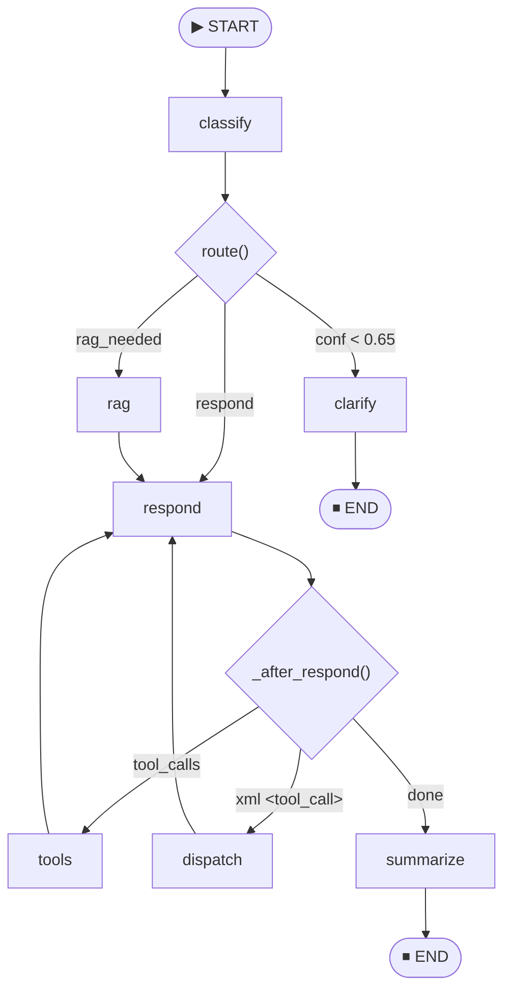
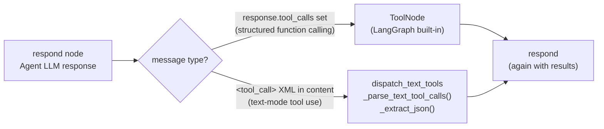
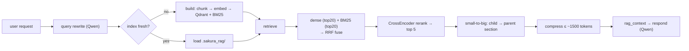
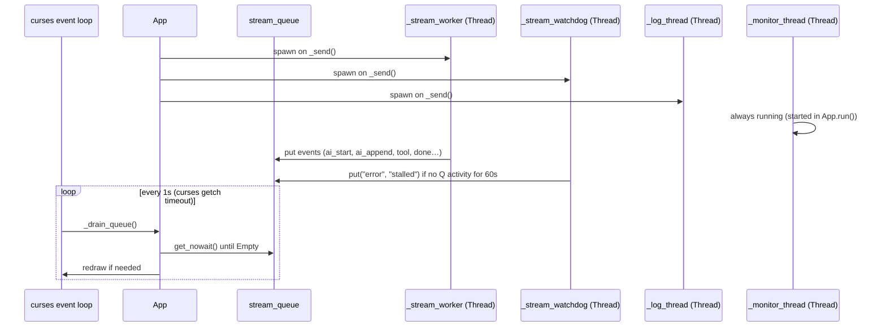

# SakuraLang — Architecture Reference

> **For AI context:** This is the canonical technical map of the codebase. Update this file whenever significant structural changes are made.

---

## Top-Level Code Structure

```
main.py
  ├─ Settings block        load_settings() / save_settings() / DEFAULT_SETTINGS / SETTINGS dict
  │                        sections: agent, researcher (Qwen / RAG), classifier
  ├─ LLM factory           get_llm(address, streaming, json_mode) → ChatOpenAI
  │                        _llm_cache: dict[tuple, ChatOpenAI]
  │                        rebuild_llms() — flushes cache (called on settings save)
  ├─ AgentState            TypedDict — graph state schema (see below)
  ├─ Constants             CLASSIFIER_SYSTEM, RESEARCHER_SYSTEM, QUERY_REWRITE_PROMPT,
  │                        DOMAIN_PROMPTS, thresholds, API URLs
  ├─ Tools                 run_powershell, run_python, launch_app
  │                        _run_proc() — shared subprocess helper with taskkill cleanup
  │                        _parse_text_tool_calls() — XML <tool_call> parser
  │                        _extract_json() — JSON extractor tolerant of prose/fences
  ├─ Graph nodes           classify, route (conditional fn), clarify, rag (Hybrid RAG),
  │                        respond (dual-path: Qwen-grounded or agent+tools),
  │                        dispatch_text_tools, _after_respond (conditional fn), summarize
  ├─ Graph builder         StateGraph compiled with SqliteSaver checkpointer
  │                        persistence file: chat_history.db
  └─ App class             curses TUI (see below)

rag.py                     Hybrid RAG engine (imported lazily by the rag node)
  ├─ Chunking              _classify() / _chunk_file() — per-file-type small-to-big chunks
  ├─ Fusion                _rrf_fuse() — Reciprocal Rank Fusion of dense + sparse hits
  ├─ _Engine               per-cwd index: Qdrant (dense) + BM25 (sparse) + CrossEncoder
  │                        ensure() build/load, retrieve() = hybrid→rerank→small-to-big→compress
  └─ public API            ensure_indexed(cwd), retrieve(query, cwd)
```

---

## AgentState Schema

```python
class AgentState(TypedDict, total=False):
    messages:     Annotated[list, add_messages]  # full conversation; add_messages reducer
    intent:       str    # chat | question | task | research | code | troubleshoot | document
    domain:       str    # general | coding | network | windows | hotel_it |
                         # verifone | ai_runtime | finance | legal_hr
    confidence:   float  # 0.0–1.0 from classifier LLM
    rag_needed:   bool
    tools_needed: list[str]
    routing_note: str    # human-readable routing debug string, shown in TUI
    summary:      str    # rolling compression of messages older than WINDOW_SIZE
    rag_context:  str    # retrieved + compressed context from rag.py (consumed by respond)
```

---

## Graph Topology



### Edge Table

| From | Condition | To |
|---|---|---|
| START | — | classify |
| classify | `confidence < CONFIDENCE_THRESHOLD (0.65)` | clarify |
| classify | `rag_needed == True` | rag |
| classify | otherwise | respond |
| clarify | — | END |
| rag | — | respond || respond | `last message has tool_calls` | tools |
| respond | `last message has <tool_call> XML` | dispatch_text_tools |
| respond | otherwise | summarize |
| tools | — | respond |
| dispatch_text_tools | — | respond |
| summarize | — | END |

---

## Key Constants

| Name | Value | Role |
|---|---|---|
| `CONFIDENCE_THRESHOLD` | `0.65` | Route to clarify if below |
| `WINDOW_SIZE` | `20` | Messages kept in LLM context |
| `SUMMARIZE_THRESHOLD` | `40` | Total messages before auto-summarise |
| `MONITOR_URL` | `http://100.66.64.45:8086/api/sakura/monitor` | System metrics poll |
| `LOGS_URL` | `http://100.66.64.45:8086/api/sakura/logs` | Inference log poll |
| `SETTINGS_FILE` | `<script_dir>/settings.json` | Config persistence path |

---

## App Class — Member Reference

```python
class App:
    # State
    stdscr          # curses window
    graph           # compiled LangGraph
    view            # VIEW_HOME | VIEW_CHAT | VIEW_SETTINGS
    thread_id       # LangGraph checkpoint thread key ("default" or "chat_YYYYMMDD_HHMMSS")
    history         # list of (role, content) tuples for TUI display
    input_buf       # current input text
    input_cursor    # cursor position in input_buf
    thinking        # bool — True while stream_worker is running

    # Streaming / cancellation
    _stream_queue   # Queue — events from stream_worker to main loop
    _cancel_event   # threading.Event — set to request stream cancellation
    _ignore_stream  # bool — discard queued events after ESC cancel
    _ai_idx         # index of the current AI history entry being appended to

    # Monitor / logs
    _monitor_data   # dict — latest /monitor JSON response
    _gpu_history    # deque(maxlen=20) — rolling GPU snapshots @ 0.5s
    _log_lines      # list[str] — latest log lines from /logs endpoint
    _stop_event     # threading.Event — stops monitor threads on exit

    # Settings editor
    settings_focus   # int — currently focused field index (0–4)
    settings_bufs    # list[str] — editable field buffers
    settings_cursors # list[int] — cursor positions per field

    # Chat list modal (F2)
    _chats_modal_open  # bool — True while the modal overlay is visible
    _chats_list        # list[dict] — [{"thread_id": str, "count": int}, ...]
    _chats_cursor      # int — currently highlighted row in the modal
    _db_path           # str — path to chat_history.db for direct SQLite queries
```

---

## Streaming Event Protocol

Events are `tuple` objects placed in `_stream_queue` by `_stream_worker` and consumed by `_drain_queue`.

| Event tuple | Meaning |
|---|---|
| `("classify", routing_note)` | Routing decision available; append router line to history |
| `("ai_start", token)` | First token of AI response; create new history entry |
| `("ai_append", token)` | Subsequent token; extend current AI history entry |
| `("ai_next",)` | Tool result processed; reset `_ai_idx` for next AI entry |
| `("ai_strip_tool_calls",)` | Remove raw XML `<tool_call>` blocks from current AI entry |
| `("tool", name, content)` | Tool executed; append tool result to history |
| `("token_usage", dict)` | Update `_last_token_usage` for monitor panel display |
| `("compact_done", freed)` | Manual compact finished; show freed-token count |
| `("done",)` | Stream complete; set `thinking = False` |
| `("error", message)` | Error occurred; append error to history; set `thinking = False` |

---

## Tool Call Dispatch — Two Paths



`_parse_text_tool_calls(content)` — regex-parses `<tool_call><function=name><parameter=x>…</parameter></function></tool_call>` blocks.

`dispatch_text_tools` also strips the raw XML from the displayed AI message so users see clean output.

---

## Classifier Retry Logic

```
Attempt 1: [SystemMessage(CLASSIFIER_SYSTEM), HumanMessage(user_text)]
           → parse JSON from response
           ↓ (if parse fails)
Attempt 2: [SystemMessage, HumanMessage, AIMessage(raw), HumanMessage(CLASSIFIER_RETRY_MSG)]
           → parse JSON again
           ↓ (if confidence == 0.0 on any successful parse)
Shock retry: [SystemMessage, HumanMessage, AIMessage(raw), HumanMessage(CLASSIFIER_CONFIDENCE_RETRY_MSG)]
           → use shock result if confidence > 0.0

Hard fallback: intent=chat, domain=general, confidence=0.0 → route to respond
```

---

## Settings JSON Schema

```json
{
  "agent": {
    "address":       "http://host:9090/v1",
    "system_prompt": "",
    "cwd":           ""
  },
  "researcher": {
    "address":       "http://100.83.3.32:9090/v1",
    "system_prompt": ""
  },
  "classifier": {
    "address":       "http://host:9091/v1",
    "system_prompt": ""
  }
}
```

`load_settings()` deep-merges file values over `DEFAULT_SETTINGS`, so new keys added to defaults are always present even on older config files. The `researcher` section drives the Qwen endpoint used by the Hybrid RAG pipeline (query rewriting + grounded answer synthesis).

---

## Hybrid RAG (`rag.py`)

The `rag` graph node delegates retrieval to `rag.py`, a self-contained Hybrid RAG
engine. "Hybrid" = dense vector search (concepts) **fused** with sparse BM25 search
(exact identifiers like model names, error codes, IPs, PLUs, config keys).



### Stack

| Stage | Implementation |
|---|---|
| Embeddings (dense) | `HuggingFaceEmbeddings` — `BAAI/bge-small-en-v1.5` (normalised, cosine) |
| Vector store | Qdrant **local/on-disk** mode (`QdrantClient(path=...)`), no server |
| Keyword (sparse) | `BM25Retriever` (`rank_bm25`), rebuilt in-memory each process |
| Fusion | `_rrf_fuse()` — Reciprocal Rank Fusion over the two ranked lists |
| Rerank | `CrossEncoderReranker` + `cross-encoder/ms-marco-MiniLM-L-6-v2`, top 5 |
| Small-to-big | small child chunks are searched; their **parent section** is returned |
| Compress | greedy token-budget packing (`CONTEXT_TOKEN_BUDGET ≈ 1500`) |

### Chunking by document type (`CHUNK_PARAMS`)

| Type | Detection | Parent / child |
|---|---|---|
| `doc` | `.md`, `.txt`, default | 3600 / 900 chars (~900 / ~225 tok) |
| `code` | source extensions (language-aware splitter) | 2400 / 700 chars |
| `config` | `.json`, `.yaml`, `.ini`, `.xml`, … | 2000 / 600 chars |
| `log` | `.log` or "log" in name | 120 / 30 lines |
| `csv` | `.csv`, `.tsv` (header repeated per chunk) | 50 / 10 rows |

### Persistence & freshness

- Index lives in `<agent.cwd>/.sakura_rag/` (`meta.json` + `qdrant/`), gitignored.
- A corpus **signature** (hash of each file's relpath+mtime+size) is stored; on the
  next run the index is reused if unchanged, else rebuilt — no needless re-embedding.
- Heavy imports (torch / sentence-transformers / qdrant) are **lazy**, so app
  startup stays instant; models load only on first RAG use.

### Engine constants

| Name | Value | Role |
|---|---|---|
| `RETRIEVE_K` | `20` | candidates pulled from each retriever before fusion |
| `RERANK_TOP_N` | `5` | survivors after cross-encoder rerank |
| `CONTEXT_TOKEN_BUDGET` | `1500` | max tokens of context handed to Qwen |
| `MAX_FILE_BYTES` | `5 MiB` | files larger than this are skipped |

---

---

## UI View Layout

```
┌─────────────────────────────────────────────────────────────────────┐
│ [menubar: F1 Chat  F2 Chats  F5 Compact  F12 Settings]             │ row 0
├────────────────────────────────────────────┬────────────────────────┤
│                                            │ [ Monitor ]            │
│  Chat history (scrollable)                 │  @ HH:MM:SS            │
│                                            │  - system              │
│  You:  <user message>                      │    CPU  xx.x%          │
│  AI:   <streaming response>                │    RAM  x.x/x.x GiB    │
│  [Router → intent/domain (conf: x.xx)]     │  - gpu                 │
│  [Tool: run_powershell]                    │    [0] RX 7900 XTX     │
│  <tool output>                             │    VRAM 12345/24564 MiB │
│                                            │    85% 220W 72°C       │
│                                            │  - context             │
│                                            │    in:  1,234          │
│                                            │    out:   512          │
├────────────────────────────────────────────┴────────────────────────┤ sep_row
│ > input text here_                                                  │ input area
│                                                                     │ (3 rows)
└─────────────────────────────────────────────────────────────────────┘
  ← chat_w (75% when wide) →  ← panel_w (25%, min 20 cols) →
  Monitor panel only shown when terminal width ≥ 60 columns.
```

---

## Concurrency Model



All worker threads are daemon threads. The main thread owns curses. `_stop_event` is set on exit to terminate the monitor threads cleanly.

---

## Colour Scheme

```python
# Custom colours (when terminal supports 16+ colours)
pink         = color(1000, 714, 796)   # index 8  — menubar background
purple       = color( 471, 235, 706)   # index 9  — menubar foreground
trans_pink   = color( 961, 663, 722)   # index 10 — user messages
trans_blue   = color( 357, 808, 980)   # index 11 — AI messages
pastel_purple= color( 784, 667, 902)   # index 12 — router/monitor lines
lime         = color( 588, 902, 392)   # index 13 — tool output

# Colour pairs
pair 1: purple on pink     → menubar, separators
pair 2: trans_pink on black → user messages
pair 3: trans_blue on black → AI messages
pair 4: pastel_purple on black → router notes, monitor panel
pair 5: lime on black       → tool output
```
