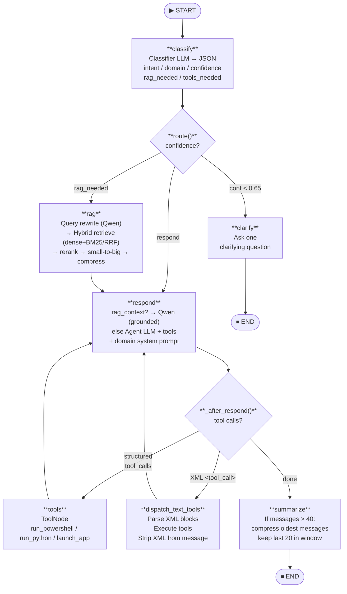

# SakuraLang — Engineering Report

> **For new engineers:** This document is your onboarding guide to SakuraLang. It explains what the project does, how to get it running, and the concepts you need to understand the codebase.

---

## What Is SakuraLang?

SakuraLang is a **terminal-based AI chat client** (TUI) written entirely in Python. It runs in the console using the `curses` library and connects to **three locally-hosted, OpenAI-compatible LLM endpoints** — a main *agent* model, a smaller *classifier* model, and a fast *researcher* model (Qwen) that powers retrieval. These are orchestrated by a [LangGraph](https://langchain-ai.github.io/langgraph/) state machine that handles intent routing, tool execution, Hybrid RAG retrieval, and automatic context compression.

The core application lives in `main.py`, with the Hybrid RAG engine in a companion module `rag.py`. There is no web server, no frontend build step, and no cloud dependency — everything targets a self-hosted AI stack (e.g. [llama.cpp](https://github.com/ggerganov/llama.cpp) or any OpenAI-compatible server).

---

## Quick Start

### Prerequisites

- Python **3.11+**
- A running **OpenAI-compatible LLM server** on port **9090** (the agent/main model)
- A running **OpenAI-compatible LLM server** on port **9091** (the classifier — can be a smaller/faster model, or the same one)
- A running **OpenAI-compatible LLM server** at **100.83.3.32:9090** (the researcher — Qwen 3.6 35B-A3B via llama.cpp; powers Hybrid RAG)
- *(Optional)* A monitor/log API on port **8086** (see [Monitor Panel](#monitor-panel) below)

### Install & Run

```bash
pip install -r requirements.txt
python main.py
```

On Windows, `windows-curses` is listed in `requirements.txt` and installed automatically.

---

## Key Bindings

| Key | Action |
|---|---|
| **F1** | Open Chat view |
| **F2** | Open Chats list modal (switch / create / delete threads) |
| **F5** | Compact context (manual summarise + clear history) |
| **F12** | Open Settings view |
| **ESC** | Cancel current inference / close modal / go back / quit from Home |
| **PgUp / PgDn** | Scroll chat history |
| **Enter** | Send message |

### Chats modal (F2)

| Key | Action |
|---|---|
| **↑ / ↓** | Move selection |
| **Enter** | Switch to selected chat (reloads history from DB) |
| **N** | Create a new empty chat thread |
| **D** | Delete selected chat (not available for the active thread) |
| **ESC / F2** | Close modal without switching |

The active thread is marked with **●**. Chats are ordered by most-recent activity.

---

## Configuration

Settings are stored in `settings.json` next to `main.py` and auto-created with defaults on first run. You can also edit them live inside the app via **F12** — changes are saved when you press ESC.

| Field | Default | Purpose |
|---|---|---|
| `agent.address` | `http://100.66.64.45:9090/v1` | OpenAI-compatible base URL for the main model |
| `agent.system_prompt` | *(empty)* | Prefix added to the agent's system prompt |
| `agent.cwd` | *(empty)* | Working directory for tools **and the Hybrid RAG corpus** |
| `researcher.address` | `http://100.83.3.32:9090/v1` | Qwen endpoint for query rewriting + grounded RAG answers |
| `researcher.system_prompt` | *(empty)* | Override for the researcher's system prompt |
| `classifier.address` | `http://100.66.64.45:9091/v1` | OpenAI-compatible base URL for the classifier model |
| `classifier.system_prompt` | *(empty)* | Override for the classifier's system prompt |

---

## How the AI Pipeline Works

Every user message passes through a **four-phase LangGraph pipeline**. You can see the routing decision printed in purple in the chat view after each message.



### Phase 1 — Classify

A lightweight classifier LLM is called first. Its sole job is to return a **single JSON object** — no prose, no markdown — with these fields:

| Field | Values |
|---|---|
| `intent` | `chat`, `question`, `task`, `research`, `code`, `troubleshoot`, `document` |
| `domain` | `general`, `coding`, `network`, `windows`, `hotel_it`, `verifone`, `ai_runtime`, `finance`, `legal_hr` |
| `confidence` | `0.0` – `1.0` |
| `rag_needed` | `true` / `false` |
| `tools_needed` | array of strings |

The classifier has three layers of error recovery: JSON parse retry (up to 2 attempts), a "shock retry" if `confidence` comes back as `0.0`, and a hard fallback to `chat / general` if everything fails.

### Phase 2 — Route

A pure Python function reads the classification and picks the next node:

- `confidence < 0.65` → ask a clarifying question, then stop
- `rag_needed == true` → **RAG node** (Hybrid RAG: rewrite → retrieve → rerank → compress), then respond
- Otherwise → respond directly

### Phase 3 — Respond

The respond node has **two paths**. If the RAG node retrieved context, the **Qwen researcher** answers grounded strictly in that context (no tools). Otherwise the main **agent LLM** is called with a **domain-specific system prompt** and three bound tools; if it calls any, the tools run and the model is called again with the results.

### Phase 4 — Summarise

When the total message count exceeds **40**, the oldest messages (everything except the last 20) are compressed into a rolling summary. The summary is prepended to future LLM calls to preserve context without blowing up the context window.

---

## Tools Available to the Agent

| Tool | Description | Timeout |
|---|---|---|
| `run_powershell` | Execute a PowerShell command and return stdout/stderr | 15 s |
| `run_python` | Execute a Python snippet and return stdout/stderr | 15 s |
| `launch_app` | Spawn a long-running detached process and return immediately | none |

The `cwd` from settings is passed as the working directory for the first two tools.

> **Windows note:** Long-running processes launched via `run_powershell` are killed using `taskkill /F /T` on timeout to clean up the full process tree.

---

## Monitor Panel

When the terminal is **≥ 60 columns wide**, the right quarter of the Chat view shows a live system monitor. It polls `http://<host>:8086/api/sakura/monitor` every second and displays:

- **CPU** usage (%)
- **RAM** used / total (GiB) + percentage
- Per-**GPU**: VRAM used/total, utilisation (10-second rolling average), power (W), temperature (°C), clock (MHz)
- **Token usage** from the last LLM call (input / output token counts)

During active inference, the bottom of the screen shows live log lines fetched from `:8086/api/sakura/logs`.

---

## Context Compaction (F5)

Pressing **F5** in Chat view triggers a manual compact: the entire current conversation is summarised into a single paragraph and all messages are removed from the LangGraph checkpoint. This is useful when you want to start a fresh topic without losing continuity, or when you are approaching the model's context limit.

---

## File Map

| File | Purpose |
|---|---|
| `main.py` | Core application — settings, graph, tools, TUI |
| `rag.py` | Hybrid RAG engine — indexing, dense+sparse retrieval, rerank, compress |
| `requirements.txt` | Python dependencies |
| `settings.json` | Runtime configuration (auto-created, gitignored) |
| `chat_history.db` | SQLite checkpoint store for LangGraph (auto-created) |
| `<agent.cwd>/.sakura_rag/` | Persisted RAG index (auto-created, gitignored) |
| `engineering-report.md` | This document |
| `architecture.md` | Concise technical architecture reference (for AI context) |
| `mermaid/graph-flow.mmd` | LangGraph state machine diagram source |
| `mermaid/system-overview.mmd` | High-level system diagram source |
| `mermaid/streaming-flow.mmd` | Streaming event sequence diagram source |
| `mermaid/rag-pipeline.mmd` | Hybrid RAG pipeline diagram source |

---

## Domain Reference

The classifier picks a domain which selects a specialised system prompt for the agent:

| Domain | System Prompt Summary |
|---|---|
| `general` | Helpful general-purpose assistant |
| `coding` | Expert software engineer |
| `network` | Expert network engineer |
| `windows` | Expert Windows systems administrator |
| `hotel_it` | Hotel IT support engineer |
| `verifone` | Verifone payment systems technician |
| `ai_runtime` | AI infrastructure and runtime engineer |
| `finance` | Finance assistant |
| `legal_hr` | HR and legal information assistant |

---

## Dependencies

```text
langchain-openai              # LLM client and message types
langgraph                     # StateGraph orchestration
langgraph-checkpoint-sqlite   # Persistent conversation checkpoints
windows-curses                # curses compatibility shim (Windows only)

# Hybrid RAG (rag.py)
langchain                     # retrievers / compressors (CrossEncoderReranker)
langchain-community           # BM25Retriever, HuggingFaceCrossEncoder
langchain-huggingface         # HuggingFaceEmbeddings
langchain-qdrant              # Qdrant vector store integration
qdrant-client                 # on-disk local vector DB
sentence-transformers         # embedding + cross-encoder models
rank-bm25                     # sparse keyword retrieval
```

---

## Known Limitations / Future Work

- **`tools_needed`** from the classifier is captured in state but not currently used to filter which tools are offered to the agent.
- **Hybrid RAG** is dense+sparse with RRF fusion and cross-encoder reranking; it does **not** yet use Qdrant-native sparse vectors or a parent-document store beyond the in-memory map. First query after a corpus change pays a one-time (re)index cost.
- The monitor and log endpoints are hardcoded to `100.66.64.45:8086` but are overridable via the settings JSON if the key is added manually.
- There is no authentication on the LLM endpoints — assumed to be running on a trusted local network.
